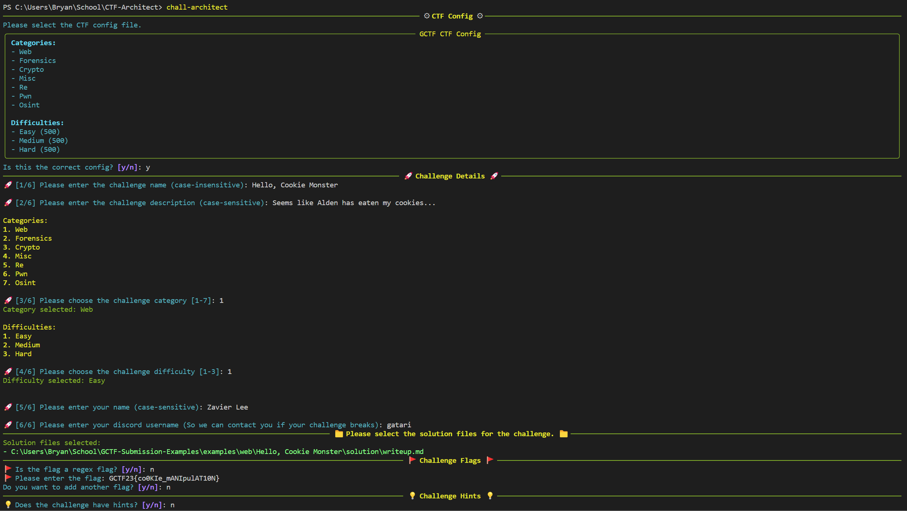

# Packaging Challenges

!!! note
    This guide assumes that you have successfully installed CTF-Architect. If you have not, please refer to the [installation guide](./installation.md).

## Download ctf_config.toml
Download the relavant `ctf_config.toml` file for the CTF. If you do not have this file, contact the CTF organizers for it.

## Prepare Your Files
Prepare the following files for your challenge:

- **Solution Files**: The writeup or solution files for the challenge.
- **Challenge Files**: The files that the participants will interact with to solve the challenge.
- **Service Folders**: If your challenge requires a service, create a folder for the service. This folder should contain the files required to run the service and a `Dockerfile`.

## Packaging a Challenge
To package a challenge for submission, run the following command:

```bash
chall-architect

# or

python3 -m ctf_architect.chall_architect # Linux and MacOS
py -3 -m ctf_architect.chall_architect # Windows
```




## Submitting a Challenge
If everything goes well, your challenge should be nicely packaged in a folder. You can now **zip** the folder and submit it. 

!!! warning
    Ensure that it is a **.zip** file, and not a **.rar** or **.7z** file.